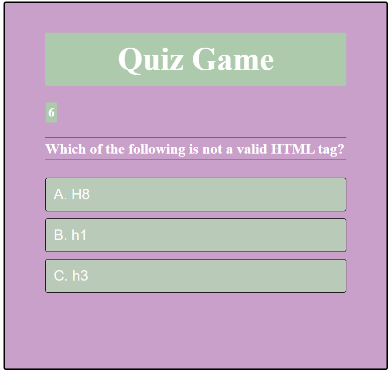

# Challenge-6-Quiz-Game
Multiple choice coding quiz

https://zainase7835.github.io/Challenge-6-Quiz-Game/

## Description:
The aim of this project was to create a multiple-choice coding quiz

## Lessons learnt from this project:
- Selecting HTML elements using getElementById() method
- Set counter using setInterval function in JS
- Adding event listeners

## Usage:
Click on the start quiz button to start the multiple choice quiz. This is a timed quiz, each question has 10 seconds. The total score should appear at the end of the quiz.

## Installation:
N/A

## Credits:
N/A

## License:
Please refer to the LICENSE in repository
